# NebulaX // OrbitGuard

**A Cyber-Physical Fusion Range for Multi-Domain Threat Simulation**

NebulaX is a production-grade, containerized cyber range that fuses live orbital mechanics with automated adversary emulation. It simulates a defense contractor — Astra Dynamics — under coordinated, state-sponsored attack across both terrestrial and space domains. The system provides a unified "Single Pane of Glass" correlating real satellite telemetry with cyber threat data in real time.

This is not a conceptual project. It is a fully operational, event-driven platform comprising 26+ microservices, a 3D orbital visualization frontend, a custom SIEM pipeline, and an ML-powered satellite attribution engine.

**OrbitGuard** is the space cybersecurity layer that distinguishes this project. It ingests live NORAD satellite data, propagates real orbital mechanics via SGP4, runs a six-module Space War Detector grounded in real-world geopolitical signals, and uses a machine learning classifier to attribute satellites to nation-states — all feeding into a 3D Cesium visualization that fuses orbital threats with ground-based cyber intrusions in a single operational picture. See [docs/ORBITGUARD.md](docs/ORBITGUARD.md) for a full technical deep dive.

---

## What It Does

| Domain | Capability |
|--------|-----------|
| **Space Operations** | Ingests live NORAD TLE data, propagates satellite orbits via SGP4, runs an ML classifier for country attribution, and executes a six-module Space War Detector to assess orbital threats |
| **Red Team** | Seven automated adversary services emulate APT kill chains: SSH brute force, SQL injection, payload delivery, ransomware simulation, C2 beaconing, and credential harvesting |
| **Blue Team** | Six defensive services provide layered detection: an SSH honeypot with interactive deception, a rule-based SIEM, Suricata-simulated IDS alerts, an EDR agent, network forensics automation, and flow analysis |
| **Fusion Center** | A Next.js dashboard with a live Cesium 3D globe unifies space and cyber telemetry into a single threat picture, including a dynamic DEFCON indicator |
| **GRC & Intelligence** | Compliance mapping (GDPR, NIST, CFAA), automated incident reporting, CVE feed simulation, and IOC synchronization |

---

## OrbitGuard: Space Domain Awareness

The space domain stack is the technical centerpiece. Every component ingests real data or models a documented real-world threat:

| Module | What It Does |
|--------|-------------|
| **SGP4 Propagator** | Fetches live NORAD TLEs from Space-Track, propagates orbits with Skyfield, computes topocentric look-angles from a Chicago ground station |
| **ML Country Attribution** | RandomForestClassifier trained at runtime on live orbital parameters (inclination + apogee) against SATCAT ground truth — predicts operating nation-state with confidence score |
| **ManeuverDetector** | Tracks altitude and inclination changes between TLE epochs to identify propulsive maneuvers — a precursor indicator for rendezvous missions |
| **ProximityDetector** | O(N²) distance check across all tracked satellites — flags close approaches within 50 km, modeling Rendezvous and Proximity Operations (RPO) and co-orbital stalking |
| **DebrisListener** | Monitors NORAD catalog object counts for sudden spikes indicating ASAT weapon tests or kinetic collisions |
| **GNSSWatcher** | Detects GPS/GLONASS jamming across six documented real-world conflict hotspots: Eastern Mediterranean, Black Sea, Baltic, South China Sea, Persian Gulf, Northern Norway |
| **LaunchMonitor** | Queries the Launch Library 2 API for real launch manifests — detects surge campaigns from adversary spaceports (Plesetsk, Jiuquan, Baikonur, Xichang, and others) |
| **GEOSentinel** | Monitors the geostationary belt for Russian-style inspector satellite slot drift and unauthorized GEO co-orbital proximity breaches |
| **BehavioralClassifier** | Fuses all six module outputs into an escalation score (0–100) and DEFCON level (1–5), integrated into the NebulaX game state |
| **Vulnerable Ground Station** | Flask endpoint with hardcoded credentials and predictable JWT secret — the cyber attack surface for the space domain |
| **3D Cesium Globe** | Live satellite positions as country-coded points; click any satellite to load its 90-minute SGP4-propagated orbit path as a polyline |

Full documentation: [docs/ORBITGUARD.md](docs/ORBITGUARD.md)

---

## Architecture

All services communicate through a single, schema-enforced event ingestion endpoint on the Core API. Events are persisted to PostgreSQL and consumed by detection engines, which generate secondary alert events, all feeding the dashboard in real time.

```mermaid
graph TD
    subgraph "Space Domain"
        ST[Space Tracker<br/>SGP4 + ML Attribution]
        GS[Ground Station Sim<br/>Intentionally Vulnerable]
        RF[RF Receiver<br/>SDR Simulation]
    end

    subgraph "Red Team"
        AE[Attack Engine<br/>SSH BruteForce + SQLi]
        APT[APT Emulator<br/>Kill Chain Stages]
        RS[Ransomware Sim<br/>T1486]
        WI[Web Injector<br/>SQLi / XSS / LFI]
        PA[Password Auditor<br/>Offline Cracking]
        VS[Vuln Scanner<br/>Nmap Recon]
        C2[C2 Beacon<br/>APT29/41/Lazarus]
    end

    subgraph "Target Environment"
        TW[Public Web Portal<br/>Vulnerable Flask App]
        IM[Identity Manager<br/>LDAP/AD Sim]
        II[Internal Infra<br/>SMB Sim]
    end

    subgraph "Blue Team"
        HP[SSH Honeypot<br/>Deception-as-Code]
        BS[Blue Sentinel<br/>Rule-Based SIEM]
        IDS[IDS Suricata<br/>ET Open Ruleset Sim]
        NW[Net Watchdog<br/>Flow Analysis]
        NF[Net Forensics<br/>Case Automation]
        EDR[EDR Agent<br/>Endpoint Detection]
    end

    subgraph "GRC & Intel"
        IR[Incident Reporter]
        PM[Policy Mapper<br/>GDPR / NIST / CFAA]
        CF[CVE Feeder]
        IOC[IOC Manager]
    end

    subgraph "Core Infrastructure"
        CORE[Core API<br/>FastAPI + Async]
        DB[(PostgreSQL<br/>Event Lake)]
        BUS[(Redis<br/>Pub/Sub Bus)]
        DASH[Dashboard<br/>Next.js + Cesium]
    end

    ST -->|TLE_UPDATE| CORE
    GS -->|AUTH_FAILURE / AUTH_SUCCESS| CORE
    RF -->|RF_SIGNAL_CAPTURED| CORE

    AE -->|EXPLOIT_SUCCESS| CORE
    APT -->|COMMAND_EXECUTED| CORE
    RS -->|FILE_ENCRYPTED / RANSOM_NOTE| CORE
    WI -->|WEB_TRAFFIC| CORE
    PA -->|CREDENTIAL_CRACKED| CORE
    VS -->|VULN_REPORT| CORE
    C2 -->|NETWORK_FLOW| CORE

    TW -->|WEB_TRAFFIC| CORE
    IM -->|AUTH_FAILURE| CORE
    II -->|NETWORK_FLOW| CORE

    HP -->|AUTH_FAILURE / COMMAND_EXECUTED| CORE
    BS -->|THREAT_DETECTED| CORE
    IDS -->|THREAT_DETECTED| CORE
    NW -->|THREAT_DETECTED| CORE
    NF -->|FORENSIC_CASE| CORE
    EDR -->|THREAT_DETECTED| CORE

    IR -->|INFO| CORE
    PM -->|INFO| CORE
    CF -->|VULN_REPORT| CORE
    IOC -->|INFO| CORE

    CORE --> DB
    CORE --> BUS
    DB --> DASH
```



---

## Tech Stack

| Layer | Technology |
|-------|-----------|
| **API / Backend** | Python 3.11, FastAPI, asyncio, asyncpg |
| **Database** | PostgreSQL 15 with JSONB event payloads |
| **Event Bus** | Redis 7 (pub/sub) |
| **Frontend** | Next.js 14, React, Cesium.js (via Resium) |
| **Orbital Mechanics** | Skyfield (SGP4 propagation), NORAD TLE data via Space-Track API |
| **Machine Learning** | scikit-learn RandomForestClassifier (satellite country attribution) |
| **Launch Intelligence** | Launch Library 2 API (real launch manifest data from adversary spaceports) |
| **Security Tooling** | Paramiko (SSH honeypot), python-nmap, Faker |
| **Infrastructure** | Docker Compose with named profiles |
| **Threat Framework** | MITRE ATT&CK (events tagged with technique IDs) |

---

## Quick Start

**Prerequisites:** Docker Desktop, `docker compose` v2+

```bash
git clone https://github.com/YOUR_USERNAME/nebulaX-orbitGuard.git
cd nebulaX-orbitGuard
```

### Option 1: Full System (All 26+ containers)

```bash
docker compose --profile full up --build
```

### Option 2: Incremental Start (Recommended — preserves disk space)

```bash
# Full system with incremental Docker pruning
./inc_cycle.sh

# Space dashboard only
./inc_space.sh
```

### Option 3: Selective Profiles

```bash
# Core infrastructure only (API, database, dashboard)
docker compose --profile core up

# Space domain + core
docker compose --profile core --profile space up

# Red Team + target environment
docker compose --profile red up

# Blue Team defensive stack
docker compose --profile blue up
```

### Access Points

| Service | URL | Notes |
|---------|-----|-------|
| Fusion Center Dashboard | `http://localhost:3000` | Main UI |
| Orbital Visualization | `http://localhost:3000/space` | 3D Cesium globe |
| Core API (Swagger) | `http://localhost:8000/docs` | Event ingestion & game state |
| Vulnerable Target Portal | `http://localhost:8080` | Intentionally exploitable |
| Ground Station | `http://localhost:5001` | Weak credentials: `admin / solarwinds123` |
| SSH Honeypot | `localhost:2222` | Accepts all credentials |

### Demo Credentials (Fusion Center)

| Persona | Role | Username | Password |
|---------|------|----------|----------|
| Director | Fusion Center | `director` | `astra` |
| Operator | Space Guard | `operator` | `orbit` |
| Analyst | Blue Team | `analyst` | `defense` |
| Syndicate | Red Team | `syndicate` | `hunter2` |

### OrbitGuard: Space Dashboard

```bash
# Start OrbitGuard + core infrastructure
docker compose --profile core --profile space up --build

# Open Space Command
open http://localhost:3000/space
```

The space tracker begins publishing `TLE_UPDATE` events within ~30 seconds. Satellites appear on the Cesium globe, color-coded by operating nation. Click any satellite for its 90-minute SGP4-propagated orbit path. The Strategic Analysis panel shows the live DEFCON level and Space War Detector outputs.

**Space-Track credentials (optional):** Add `SPACETRACK_USER` and `SPACETRACK_PASS` to `.env` for access to the full NORAD catalog. Without credentials, the tracker automatically falls back to Celestrak — all features remain functional.

---

## Docker Compose Profiles

| Profile | Services Included |
|---------|------------------|
| `core` | postgres, redis, core-api, dashboard |
| `space` | space-tracker, ground-station, rf-receiver |
| `red` | attack-engine, apt-emulator, ransomware-sim, web-injector, password-auditor, vuln-scanner, c2-beacon |
| `blue` | honeypot, blue-sentinel, ids-suricata, net-watchdog, net-forensics, edr-agent |
| `target` | target-web, internal-infra, identity-manager |
| `intel` | cve-feeder, ioc-manager |
| `grc` | incident-reporter, policy-mapper |
| `full` | All of the above |

---

## Service Catalog

### Core Infrastructure

| Container | Purpose | Port |
|-----------|---------|------|
| `nebulax-core` | FastAPI event ingestion, game state, orbit computation | 8000 |
| `nebulax-db` | PostgreSQL event lake with JSONB payloads | 5432 |
| `nebulax-bus` | Redis pub/sub event bus | 6379 |
| `nebulax-dashboard-v2` | Next.js + Cesium visualization frontend | 3000 |

### Space Domain

| Container | Purpose |
|-----------|---------|
| `nebulax-space-tracker` | Fetches NORAD TLEs, runs SGP4 propagation, ML country attribution, Space War Detector |
| `nebulax-ground-sim` | Intentionally vulnerable ground station (JWT, hardcoded secrets) |
| `nebulax-rf-receiver` | Simulates RTL-SDR software-defined radio signal capture |

### Red Team

| Container | MITRE Technique | Behavior |
|-----------|----------------|---------|
| `nebulax-red-attacker` | T1110 | SSH brute force + SQL injection against targets |
| `nebulax-apt-emulator` | T1059 | Simulates full APT kill chain stage progression |
| `nebulax-ransomware` | T1486, T1491 | File encryption simulation with ransom note delivery |
| `nebulax-web-injector` | T1190 | SQLi, XSS, and path traversal payloads |
| `nebulax-password-auditor` | T1110.004 | Offline credential cracking from honeypot captures |
| `nebulax-vuln-scanner` | T1046 | Nmap-based network reconnaissance |
| `nebulax-c2-beacon` | T1071 | C2 heartbeat and data exfiltration simulation (APT29/41/Lazarus IPs) |

### Blue Team

| Container | Capability |
|-----------|-----------|
| `nebulax-honeypot` | Interactive SSH deception shell — logs credentials and commands |
| `nebulax-blue-sentinel` | Rule-based detection engine, correlates exploit events |
| `nebulax-ids-suricata` | Simulates Suricata ET Open alerts (Log4j, Cobalt Strike, Nmap) |
| `nebulax-edr-agent` | Endpoint detection (PowerShell, LSASS, driver loads, registry persistence) |
| `nebulax-net-watchdog` | Network flow analysis, data exfiltration detection |
| `nebulax-net-forensics` | Automated forensic case file generation |

### Target Environment

| Container | Vulnerability |
|-----------|--------------|
| `nebulax-target-web` | Flask app with SQL injection login (`admin / flag{astra_master_key_xyz}`) |
| `nebulax-identity-manager` | Simulates LDAP/AD authentication failures |
| `nebulax-internal-infra` | Simulates SMB file share activity |

---

## Key Technical Features

**Orbital Mechanics Engine**
The space tracker fetches real NORAD Two-Line Element sets from the Space-Track API (with Celestrak fallback), propagates orbits using Skyfield's SGP4 implementation, and computes topocentric position from a Chicago ground station. Orbital parameters (inclination, eccentricity, apogee, perigee, period) are extracted per satellite.

**ML Country Attribution**
A RandomForestClassifier is trained at startup on live orbital parameters (inclination + apogee) against SATCAT ground truth. It predicts the operator country for every tracked satellite and computes a confidence score alongside the verified SATCAT metadata.

**Space War Detector**
A six-module threat assessment system runs every telemetry cycle: ManeuverDetector, ProximityDetector, DebrisListener, GNSSWatcher, LaunchMonitor, and GEOSentinel. Outputs are fused into a DEFCON level (1–5) and escalation score (0–100) displayed on the dashboard.

**Universal Event Schema**
Every service publishes structured events to `POST /events/ingest`. The schema enforces `event_meta` (id, timestamp, origin_module, event_type, severity), `context` (IP, asset ID, MITRE technique, compliance tag), and a flexible `payload` object. All events are persisted as JSONB for efficient querying.

**Game State Engine**
The Core API computes a live red/blue score and DEFCON level from the event stream. Red Team scores on exploits (+50), cracked credentials (+30), and discovered vulnerabilities (+10). Blue Team scores on detections (+20), logged auth failures (+5), and tracked commands (+2).

**3D Orbital Visualization**
The dashboard `SatelliteGlobe` component renders live satellite positions as color-coded points (by country) on a Cesium globe. Clicking a satellite requests the 90-minute orbit path from the Core API, which returns a `[lat, lon, alt_km]` array converted to Cartesian3 for rendering.

---

## Development

### Test a Single Service

```bash
# Start core + one service, stream logs
./scripts/test_module.sh ids-suricata
./scripts/test_module.sh ransomware-sim
```

### Local Hybrid Mode

```bash
# Start infrastructure only
./scripts/dev_core.sh

# Run a service locally against Docker infrastructure
cd services/red-team/ransomware-sim
CORE_HOST=localhost python main.py
```

### Rebuild Dashboard

```bash
docker compose build dashboard
```

---

## Documentation

Full documentation lives in [docs/](docs/).

| Document | Contents |
|----------|---------|
| [docs/ORBITGUARD.md](docs/ORBITGUARD.md) | **OrbitGuard deep dive:** orbital mechanics pipeline, each Space War Detector module, ML attribution model, ground station vulnerabilities, Cesium visualization, space-cyber fusion scenarios |
| [docs/ARCHITECTURE.md](docs/ARCHITECTURE.md) | System topology, Universal Event Schema, Core API reference, database schema, orbit computation pipeline, Docker profiles |
| [docs/THREAT_MODELS.md](docs/THREAT_MODELS.md) | MITRE ATT&CK coverage, intentional vulnerability catalog, red/blue/fusion exercise playbooks, space threat models |
| [docs/SERVICES.md](docs/SERVICES.md) | Per-service reference: behavior, events published, configuration, and dependencies for all 26+ services |
| [docs/QUICKSTART.md](docs/QUICKSTART.md) | Detailed setup guide: Space-Track API configuration, profile usage, development workflows, and troubleshooting |
| [docs/RESUME_ASSETS.md](docs/RESUME_ASSETS.md) | Technical achievement statements and skills matrix for portfolio and interview use |

---

## Legal Notice

This platform is designed exclusively for authorized security research, education, and training in isolated lab environments. The intentionally vulnerable components — SQL injection endpoints, hardcoded credentials, honeypots — are simulated targets for controlled exercises only.

**Do not deploy against production systems or networks without explicit written authorization. All activity is simulated within Docker's isolated bridge network.**

The C2 IP addresses in `c2-beacon` reference known public threat intelligence IOCs used for educational correlation purposes. No actual network connections are made to external hosts during simulation.
