# NebulaX System Architecture

**Related docs:** [ORBITGUARD.md](ORBITGUARD.md) — space domain deep dive | [SERVICES.md](SERVICES.md) — per-service reference | [THREAT_MODELS.md](THREAT_MODELS.md) — attack/defense exercises | [QUICKSTART.md](QUICKSTART.md) — setup guide

---

## Overview

NebulaX is an event-driven microservices platform. Every one of its 26+ containerized services communicates through a single canonical pathway: a structured event is `POST`ed to the Core API, persisted to PostgreSQL, and made available to any consumer via a polling endpoint. There is no direct service-to-service communication. This design creates loose coupling, a unified audit trail, and a single source of truth for the game state engine and dashboard.

Redis is present in the stack for pub/sub and is used as an optional caching layer for orbit path computation. The primary event transport is HTTP to the Core API.

---

## System Topology

```mermaid
graph TD
    subgraph SPACE ["Space Domain"]
        ST["space-tracker<br/>SGP4 + ML + War Detector"]
        GS["ground-station<br/>Vulnerable JWT Endpoint"]
        RF["rf-receiver<br/>SDR Signal Simulation"]
    end

    subgraph RED ["Red Team"]
        AE["attack-engine<br/>SSH BruteForce + SQLi"]
        APT["apt-emulator<br/>Kill Chain Stages"]
        RS["ransomware-sim<br/>T1486 / T1491"]
        WI["web-injector<br/>SQLi / XSS / LFI"]
        PA["password-auditor<br/>Offline Cracking T1110.004"]
        VS["vuln-scanner<br/>Nmap T1046"]
        C2["c2-beacon<br/>Exfil + Heartbeat T1071"]
    end

    subgraph TARGET ["Target Environment"]
        TW["target-web<br/>Vulnerable Flask App"]
        IM["identity-manager<br/>LDAP/AD Simulation"]
        II["internal-infra<br/>SMB Share Simulation"]
    end

    subgraph BLUE ["Blue Team"]
        HP["honeypot<br/>Deception SSH Shell"]
        BS["blue-sentinel<br/>Rule-Based SIEM"]
        IDS["ids-suricata<br/>ET Open Ruleset Sim"]
        NW["net-watchdog<br/>Flow Analysis"]
        NF["net-forensics<br/>Case Automation"]
        EDR["edr-agent<br/>Endpoint Detection"]
    end

    subgraph GRC ["GRC & Intel"]
        IR["incident-reporter"]
        PM["policy-mapper<br/>GDPR / NIST / CFAA"]
        CF["cve-feeder"]
        IOC["ioc-manager"]
    end

    subgraph CORE ["Core Infrastructure"]
        API["core-api<br/>FastAPI :8000"]
        DB[("postgres<br/>nebulax_core :5432")]
        BUS[("redis<br/>:6379")]
        DASH["dashboard<br/>Next.js + Cesium :3000"]
    end

    ST & GS & RF -->|events| API
    AE & APT & RS & WI & PA & VS & C2 -->|events| API
    TW & IM & II -->|events| API
    HP & BS & IDS & NW & NF & EDR -->|events| API
    IR & PM & CF & IOC -->|events| API

    API --> DB
    API --> BUS
    DB -->|polling :2s| DASH
```



---

## Network

All containers share the Docker bridge network `nebulax-net`. Services reference each other by container name (e.g., `nebulax-core`, `nebulax-honeypot`). The `CORE_HOST` environment variable is passed to each service so they can construct the ingest URL:

```
http://{CORE_HOST}:8000/events/ingest
```

### Port Map

| Port | Container | Service |
|------|-----------|---------|
| `3000` | `nebulax-dashboard-v2` | Next.js frontend |
| `8000` | `nebulax-core` | Core FastAPI |
| `8080` | `nebulax-target-web` | Vulnerable Flask portal (→ internal :5000) |
| `5001` | `nebulax-ground-sim` | Ground station (→ internal :5000) |
| `2222` | `nebulax-honeypot` | SSH honeypot |
| `5432` | `nebulax-db` | PostgreSQL |
| `6379` | `nebulax-bus` | Redis |

---

## Core API Reference

**Base URL:** `http://localhost:8000`
**Framework:** FastAPI (Python 3.11, asyncio)
**Interactive Docs:** `http://localhost:8000/docs`

### Endpoints

#### `POST /events/ingest`
Ingest a structured event from any service. All services use this single endpoint.

**Request body:** Universal Event Schema (see below)
**Response:** `{ "status": "ok", "id": "<uuid>" }`

---

#### `GET /events/recent`
Query the most recent events, optionally filtered by team or event type.

**Query parameters:**

| Parameter | Type | Default | Description |
|-----------|------|---------|-------------|
| `limit` | int | 20 | Number of events to return |
| `team` | string | — | Filter by `origin_module` prefix (e.g., `space`, `red`, `blue`) |
| `event_type` | string | — | Filter by event type (e.g., `TLE_UPDATE`, `THREAT_DETECTED`) |

**Response:** Array of event objects ordered by `timestamp DESC`

---

#### `GET /game/state`
Compute and return the current game state from the event ledger.

**Response:**
```json
{
  "red_score": 420,
  "blue_score": 185,
  "defcon": 3,
  "event_count": 1842,
  "last_updated": "2025-01-15T14:32:01Z"
}
```

**Scoring logic:**

| Event | Team | Points |
|-------|------|--------|
| `EXPLOIT_SUCCESS` | Red | +50 |
| `CREDENTIAL_CRACKED` | Red | +30 |
| `VULN_REPORT` | Red | +10 |
| `THREAT_DETECTED` | Blue | +20 |
| `AUTH_FAILURE` | Blue | +5 |
| `COMMAND_EXECUTED` | Blue | +2 |

**DEFCON thresholds (Red score):**

| DEFCON | Red Score Range | Status |
|--------|----------------|--------|
| 5 | 0 – 99 | Normal |
| 4 | 100 – 299 | Elevated |
| 3 | 300 – 499 | High |
| 2 | 500 – 999 | Severe |
| 1 | 1000+ | Critical |

---

#### `GET /satellite/orbit`
On-demand orbit path computation for a named satellite.

**Query parameters:**

| Parameter | Type | Required | Description |
|-----------|------|----------|-------------|
| `sat_name` | string | Yes | Satellite name (e.g., `ISS (ZARYA)`, `HST`) |

**Response:**
```json
{
  "sat_name": "ISS (ZARYA)",
  "orbit_path": [
    [41.89, -87.82, 408.3],
    [42.15, -85.10, 408.1],
    "..."
  ],
  "points": 45,
  "generated_at": "2025-01-15T14:32:01Z"
}
```

Each point is `[latitude_deg, longitude_deg, altitude_km]`. The path covers 90 minutes at 2-minute intervals (45 points). TLE data is sourced from the most recent `TLE_UPDATE` event in the database for the requested satellite.

---

## Universal Event Schema

Every service publishes events using this schema. The `payload` object is flexible and varies by event type.

```json
{
  "event_meta": {
    "id": "550e8400-e29b-41d4-a716-446655440000",
    "timestamp": "2025-01-15T14:32:01.123456Z",
    "origin_module": "red.apt-emulator",
    "event_type": "COMMAND_EXECUTED",
    "severity": "HIGH",
    "classification": "SIMULATION"
  },
  "context": {
    "related_ip": "192.168.1.105",
    "related_asset_id": "CEO-Laptop",
    "mitre_attack_id": "T1059",
    "legal_compliance_tag": "NIST-IR-6"
  },
  "payload": {}
}
```

### `event_meta` Fields

| Field | Type | Description |
|-------|------|-------------|
| `id` | UUID | Unique event identifier |
| `timestamp` | ISO 8601 | UTC event time |
| `origin_module` | string | Dot-namespaced source (e.g., `space.tracker`, `blue.honeypot`) |
| `event_type` | string | Categorical event type (see table below) |
| `severity` | enum | `INFO`, `LOW`, `MEDIUM`, `HIGH`, `CRITICAL` |
| `classification` | string | Always `SIMULATION` in this environment |

### `context` Fields

| Field | Type | Description |
|-------|------|-------------|
| `related_ip` | string | IP address of the subject asset |
| `related_asset_id` | string | Asset identifier (satellite name, hostname) |
| `mitre_attack_id` | string | MITRE ATT&CK technique ID |
| `legal_compliance_tag` | string | Relevant compliance clause (GDPR, NIST, CFAA) |

### Event Type Registry

| Event Type | Domain | Severity | Description |
|------------|--------|----------|-------------|
| `TLE_UPDATE` | Space | INFO | Per-satellite telemetry cycle from space tracker |
| `FINGERPRINT_UPDATE` | Space | INFO | Orbital cluster visualization (base64 PNG) |
| `RF_SIGNAL_CAPTURED` | Space | LOW | SDR signal detection event |
| `AUTH_FAILURE` | Cyber | MEDIUM | Failed authentication attempt |
| `AUTH_SUCCESS` | Cyber | CRITICAL | Successful authentication to honeypot |
| `EXPLOIT_SUCCESS` | Red | HIGH | Adversary gained access to a target |
| `COMMAND_EXECUTED` | Red | HIGH | Shell command executed by adversary (APT/honeypot) |
| `FILE_ENCRYPTED` | Red | CRITICAL | Ransomware encryption event |
| `RANSOM_NOTE` | Red | HIGH | Ransom note dropped |
| `WEB_TRAFFIC` | Cyber | MEDIUM | Web request logged (includes injections) |
| `NETWORK_FLOW` | Cyber | MEDIUM | Network connection or data transfer |
| `CREDENTIAL_CRACKED` | Red | HIGH | Offline password crack successful |
| `VULN_REPORT` | Red/Intel | MEDIUM | Vulnerability or open port discovered |
| `THREAT_DETECTED` | Blue | HIGH/CRITICAL | Detection engine alert |
| `FORENSIC_CASE` | Blue | INFO | Automated forensic investigation case |
| `INFO` | GRC/Intel | INFO | Compliance, IOC sync, incident reporting events |

---

## Database Schema

**Database:** `nebulax_core` (PostgreSQL 15)
**Driver:** asyncpg (async)

### Table: `events`

```sql
CREATE TABLE events (
    id              UUID        PRIMARY KEY DEFAULT gen_random_uuid(),
    timestamp       TIMESTAMPTZ NOT NULL DEFAULT NOW(),
    origin_module   TEXT        NOT NULL,
    event_type      TEXT        NOT NULL,
    severity        TEXT        NOT NULL DEFAULT 'INFO',
    classification  TEXT        NOT NULL DEFAULT 'SIMULATION',
    context         JSONB,
    payload         JSONB
);

CREATE INDEX idx_events_timestamp     ON events (timestamp DESC);
CREATE INDEX idx_events_origin_module ON events (origin_module);
CREATE INDEX idx_events_event_type    ON events (event_type);
```

The `context` and `payload` columns are JSONB, enabling efficient field-level queries:

```sql
-- Find all TLE updates for a specific satellite
SELECT payload->>'sat_name', payload->>'geo_lat', payload->>'geo_lng'
FROM events
WHERE event_type = 'TLE_UPDATE'
  AND payload->>'sat_name' = 'ISS (ZARYA)'
ORDER BY timestamp DESC
LIMIT 10;

-- Compute red team score from raw events
SELECT
    SUM(CASE WHEN event_type = 'EXPLOIT_SUCCESS' THEN 50 ELSE 0 END) +
    SUM(CASE WHEN event_type = 'CREDENTIAL_CRACKED' THEN 30 ELSE 0 END) +
    SUM(CASE WHEN event_type = 'VULN_REPORT' AND origin_module LIKE 'red.%' THEN 10 ELSE 0 END)
    AS red_score
FROM events;
```

---

## Orbit Computation Pipeline

The `GET /satellite/orbit` endpoint uses the following pipeline:

```
1. Query PostgreSQL for the most recent TLE_UPDATE event
   WHERE payload->>'sat_name' = requested_name

2. Extract TLE from event payload:
   { "tle": { "line1": "1 25544U ...", "line2": "2 25544 ..." } }

3. Load TLE into Skyfield EarthSatellite object
   (SGP4 propagation model)

4. Generate 45 time samples:
   t_now + [0, 2, 4, ..., 88] minutes

5. For each time sample:
   - Compute geocentric position
   - Convert to (latitude, longitude, altitude_km)

6. Return as array: [[lat, lon, alt], ...]

7. Optional: Cache result in Redis with 60-second TTL
   (disabled by default for debugging)
```

**Cesium rendering:** The dashboard `SatelliteGlobe` component receives the `[lat, lon, alt_km]` array and converts each point to `Cesium.Cartesian3.fromDegrees(lon, lat, alt_km * 1000)` for rendering as a polyline entity.

---

## Space Tracker Architecture

> For a complete deep dive on OrbitGuard's space domain — including all six Space War Detector modules, the ML country attribution model, and the space-cyber fusion scenarios — see [ORBITGUARD.md](ORBITGUARD.md).

The space tracker is the most complex single service in the platform. Its per-cycle execution flow:

```
Every 60 seconds:

1. TLE Acquisition
   └── Space-Track API (authenticated) → favorites + large objects
   └── Celestrak fallback on failure

2. Metadata Enrichment
   └── SATCAT query → country, launch year, RCS size per satellite

3. ML Classifier Training (startup + periodic refresh)
   └── Features: [inclination, apogee]
   └── Labels: country from SATCAT
   └── Model: RandomForestClassifier (scikit-learn)

4. Per-Satellite Processing (for each TLE):
   a. SGP4 propagation → current position (lat, lon, alt)
   b. Orbital parameter extraction:
      - Inclination, eccentricity
      - Apogee / perigee altitude
      - Orbital period
   c. Topocentric position from Chicago (41.88°N, 87.63°W):
      - Azimuth, elevation, slant range (km)
      - Visibility: VISIBLE / BELOW_HORIZON
   d. Next pass prediction
   e. ML country prediction + confidence score
   f. Orbital fingerprint generation (matplotlib scatter → base64 PNG)

5. Space War Detector (parallel, per-cycle):
   ├── ManeuverDetector  → evasive orbital changes
   ├── ProximityDetector → dangerous satellite proximity
   ├── DebrisListener    → space debris threat tracking
   ├── GNSSWatcher       → GPS/GLONASS jamming indicators
   ├── LaunchMonitor     → new satellite launch detection
   └── GEOSentinel       → GEO belt anomaly monitoring
   └── → Fused output: DEFCON level (1–5), escalation score (0–100), alerts[]

6. Event Publishing:
   └── POST TLE_UPDATE  (one per satellite, includes all computed fields)
   └── POST FINGERPRINT_UPDATE (cluster visualization)
```

---

## Dashboard Architecture

**Stack:** Next.js 14, React, Cesium.js (via Resium React wrapper)
**Data:** Polls `GET /events/recent` every 2 seconds per page

### Pages

| Route | Data Source | Purpose |
|-------|-------------|---------|
| `/space` | `?team=space` | Orbital visualization with Cesium globe |
| `/red` | `?team=red` | Red team activity feed and metrics |
| `/blue` | `?team=blue` | Blue team alerts and detection log |
| `/fusion` | all events | Unified threat dashboard |
| `/login` | — | Persona-based authentication |

### SatelliteGlobe Component

The `SatelliteGlobe` React component (`services/dashboard/src/components/SatelliteGlobe.js`) manages the Cesium viewer lifecycle:

1. **Initialization:** OpenStreetMap imagery provider, camera positioned over continental USA
2. **Satellite entities:** One `<Entity>` per satellite, rendered as a point colored by predicted country:
   - USA → blue
   - Russia/CIS → red
   - China → orange
   - ESA nations → purple
   - Unknown → gray
3. **Selection:** Click handler calls `GET /satellite/orbit?sat_name={name}`, receives path array, renders cyan polyline
4. **Updates:** Satellite list re-renders on each 2-second polling cycle

### Space Page (`/space`) Features

- Satellite list panel with name, country, visibility, orbital parameters
- Strategic Analysis Panel: DEFCON level, escalation score, active war alerts
- Country filter dropdown
- Event log showing recent space telemetry
- Click-to-select satellite with orbit path rendering on globe

---

## Docker Compose Profiles

Services are grouped into named profiles enabling selective deployment. Each profile automatically includes core infrastructure (postgres, redis, core-api). The `dashboard` container is part of the `core` and `full` profiles only.

```
Profile dependency tree:

full ─────────────────────────── all 26+ services
core ─────────────────────────── postgres + redis + core-api + dashboard
space ────────────────────────── core + space-tracker + ground-station + rf-receiver
red ──────────────────────────── core + 7 red team services + target-web + honeypot
blue ─────────────────────────── core + 6 blue team services
target ───────────────────────── core + target-web + internal-infra + identity-manager
intel ────────────────────────── core + cve-feeder + ioc-manager
grc ──────────────────────────── core + incident-reporter + policy-mapper
```

### Resource Limits

Memory limits are set per container to prevent swap thrashing on development hardware:

| Container | Memory Limit |
|-----------|-------------|
| `dashboard` | 2 GB |
| `space-tracker` | 128 MB |
| `vuln-scanner` | 256 MB (Nmap) |
| All other services | 128 MB |

---

## Environment Variables

The `.env` file in the repository root supplies credentials to the core infrastructure. Services receive `CORE_HOST` via Docker Compose environment injection.

| Variable | Default | Used By |
|----------|---------|---------|
| `POSTGRES_USER` | `admin` | postgres, core-api |
| `POSTGRES_PASSWORD` | `nebulax_secret` | postgres, core-api |
| `POSTGRES_DB` | `nebulax_core` | postgres, core-api |
| `REDIS_URL` | `redis://nebulax-bus:6379/0` | core-api |
| `CORE_HOST` | `nebulax-core` (in Docker) | all microservices |
| `SPACETRACK_USER` | — | space-tracker (optional) |
| `SPACETRACK_PASS` | — | space-tracker (optional) |

**Note:** If Space-Track credentials are not provided, the tracker automatically falls back to Celestrak for TLE data.
