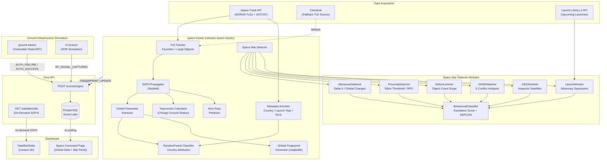
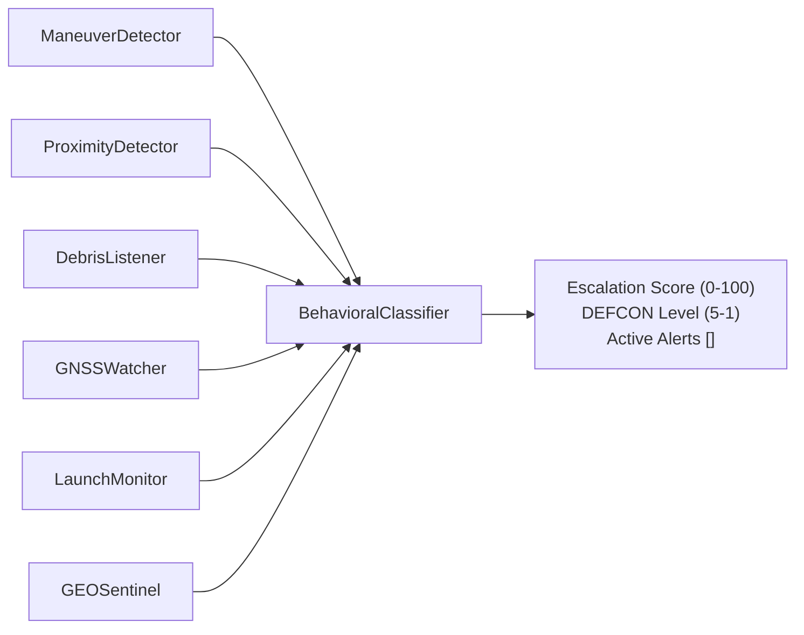

# OrbitGuard: Space Domain Cybersecurity

## What Is OrbitGuard?

OrbitGuard is the space cybersecurity layer of NebulaX. Where NebulaX handles the full cyber range — adversary emulation, detection engineering, and fusion center operations — OrbitGuard is the dedicated subsystem that brings space domain awareness into that picture.

The premise is straightforward: satellites are infrastructure, and infrastructure gets attacked. Ground stations run software, speak network protocols, use JWTs and passwords, and can be brute-forced. The RF spectrum is a physical attack surface. Orbital positioning data can reveal an adversary's intent before any cyber indicator appears. OrbitGuard operationalizes all of this inside a running cyber range, so analysts can train against threats that cross the space-cyber boundary.

OrbitGuard consists of:

- A **real-time satellite tracking engine** using live NORAD TLE data and Skyfield SGP4 propagation
- A **six-module Space War Detector** that continuously assesses orbital threat conditions
- An **ML-powered country attribution system** for tracked satellites
- A **vulnerable ground station simulation** for space-cyber convergence exercises
- An **RF signal monitoring layer** simulating software-defined radio collection
- A **3D Cesium visualization** fusing orbital telemetry with cyber event data

---

## The Space Cybersecurity Problem

Modern space operations depend on terrestrial infrastructure that carries all the vulnerabilities of any enterprise IT environment. The OrbitGuard threat model reflects three real-world attack surfaces:

**Ground Station Compromise**
Ground stations are the command and control nodes for satellite operations. They authenticate operators, issue uplink commands, and receive downlink telemetry. A compromised ground station enables an adversary to jam, spoof, or seize control of the satellite itself. OrbitGuard simulates this with a deliberately vulnerable ground station endpoint using hardcoded credentials and a predictable JWT signing key.

**Orbital Domain Awareness as Intelligence**
Orbital mechanics reveal intent. A satellite that performs an unexpected maneuver near a high-value GEO asset may be an inspector satellite on a co-orbital stalking mission. A sudden spike in launch cadence from an adversary spaceport indicates a surge. GNSS jamming correlates with geopolitical escalation in documented conflict zones. OrbitGuard's Space War Detector turns these signals into structured intelligence events.

**Cross-Domain Attack Timing**
Space-based capabilities like GPS, satellite communications, and Earth observation are often degraded or targeted *before* a conventional cyber or kinetic attack begins. OrbitGuard's integration into the NebulaX fusion center lets operators observe whether a GNSS jamming alert or proximity event precedes or coincides with ground-based intrusion activity — the kind of correlation that only becomes visible when both domains are in the same operational picture.

---

## Architecture



---

## Component Deep Dives

### TLE Data Acquisition

Two-Line Element sets are the universal format for describing a satellite's orbit. Each TLE encodes the Keplerian elements — inclination, right ascension of the ascending node, eccentricity, argument of perigee, mean anomaly, and mean motion — plus drag coefficients, allowing SGP4 to propagate the satellite's position forward or backward in time.

OrbitGuard fetches TLEs from two sources:

**Primary: Space-Track API (space-track.org)**
Operated by the 18th Space Control Squadron, Space-Track is the authoritative source for unclassified NORAD catalog data. OrbitGuard uses an authenticated session to fetch:
- **Favorites list:** ISS, HST (Hubble), NOAA-20, TERRA, AQUA — high-profile objects tracked for demonstration value
- **Large objects:** All objects with `RCS_SIZE=LARGE` — the most observable portion of the catalog

**Fallback: Celestrak**
When Space-Track credentials are unavailable or the API is unreachable, the tracker automatically falls back to Celestrak's public TLE endpoints. Celestrak mirrors NORAD data and is suitable for development environments without credentials.

**Configuration:**
```bash
# .env — Space-Track credentials (optional, Celestrak used if absent)
SPACETRACK_USER=your_username
SPACETRACK_PASS=your_password
```

---

### SGP4 Orbit Propagation

SGP4 (Simplified General Perturbations model 4) is the standard analytical propagation model for Earth-orbiting objects. It accounts for atmospheric drag, Earth's oblateness (J2 perturbation), solar radiation pressure, and lunar/solar gravity effects. Given a TLE and a timestamp, SGP4 produces a precise geocentric position and velocity vector.

OrbitGuard implements SGP4 through the **Skyfield** Python library, which provides a high-accuracy astrodynamic toolkit built on USNO conventions.

**Per-cycle computation (space-tracker):**
```
For each satellite in the TLE set:
  1. Instantiate Skyfield EarthSatellite from TLE lines
  2. Load current UTC time via Skyfield timescale
  3. Compute geocentric ITRS position vector
  4. Convert to WGS84 geodetic: latitude, longitude, altitude (km)
  5. Compute velocity vector → derive orbital period
```

**On-demand orbit path (core-api `GET /satellite/orbit`):**
```
1. Retrieve most recent TLE from PostgreSQL:
   SELECT payload->>'tle' FROM events
   WHERE event_type='TLE_UPDATE' AND payload->>'sat_name'=?
   ORDER BY timestamp DESC LIMIT 1

2. Instantiate EarthSatellite from stored TLE

3. Generate 45 time steps:
   t = [now + i*2min for i in range(45)]  →  90-minute window

4. Propagate position at each step → [lat, lon, alt_km]

5. Return array for Cesium rendering
```

The stored TLE approach means orbit paths can be computed without the tracker running — any service with Core API access can request an orbit path for any satellite the tracker has ever observed.

---

### Orbital Parameter Extraction

Beyond the raw position, OrbitGuard extracts five orbital parameters from each TLE that characterize the satellite's orbit shape and behavior:

| Parameter | Symbol | Derivation | Intelligence Value |
|-----------|--------|------------|-------------------|
| **Inclination** | i | Direct from TLE line 2 | Reveals orbital regime — polar (~98°), sun-synchronous (~98°), MEO, GEO (0°), Molniya (~63°) |
| **Eccentricity** | e | Direct from TLE line 2 | Near-circular (e≈0) vs highly elliptical (Molniya, HEO) — distinguishes mission type |
| **Apogee altitude** | h_a | Derived from mean motion + eccentricity | Upper bound of orbit — distinguishes LEO, MEO, GEO |
| **Perigee altitude** | h_p | Derived from mean motion + eccentricity | Lower bound — combined with apogee indicates orbit type |
| **Orbital period** | T | Derived from mean motion | Time per revolution — directly indicates orbital regime |

These parameters are embedded in every `TLE_UPDATE` event and are the feature inputs for the ML country attribution model. They are also displayed on the Space Command dashboard as metadata for each selected satellite.

---

### Ground Station Tracking (Chicago Observer)

The topocentric position of a satellite describes it from the perspective of an observer on the ground — in OrbitGuard's case, a fixed ground station at the **Chicago metropolitan area** (41.8952°N, 87.8257°W, 190m elevation).

For each satellite, Skyfield computes:

| Measurement | Unit | Description |
|-------------|------|-------------|
| **Azimuth** | degrees | Compass bearing to satellite (0° = North) |
| **Elevation** | degrees | Angle above horizon (negative = below horizon) |
| **Slant range** | km | Direct line-of-sight distance |
| **Visibility** | VISIBLE / BELOW_HORIZON | Elevation > 0° |

The elevation threshold determines whether the satellite is within communication range of the ground station. This drives the **next pass prediction**: the tracker computes the next time the satellite rises above the horizon, providing operators with a contact window estimate.

These values are embedded in `TLE_UPDATE` events and displayed in the satellite detail panel on the Space Command page.

---

### ML-Powered Country Attribution

Determining the operating nation-state of a satellite is a real-world intelligence problem. SATCAT provides verified country codes for most objects, but attribution can be obscured through shell companies, shared launches, and reclassification. OrbitGuard's ML classifier models this problem and provides independent predictions alongside verified data.

**Model:** `sklearn.ensemble.RandomForestClassifier`

**Training pipeline (runs at startup, periodic refresh):**
```
1. Fetch SATCAT country field for all tracked objects (Space-Track)
2. For each satellite: extract [inclination, apogee_altitude]
3. Filter out objects with missing metadata
4. Train RandomForestClassifier: features=[inclination, apogee], labels=[country]
5. Store fitted model in memory
```

**Prediction (per-satellite, each cycle):**
```
Input: [inclination, apogee_altitude]
Output: { country: "USA", confidence: 0.87 }
```

**Why these features work:** Different nations favor distinct orbital regimes for their satellite programs. US reconnaissance satellites cluster in high-inclination sun-synchronous orbits. Russian communications satellites use the Molniya orbit (high eccentricity, 63° inclination). Chinese LEO constellations favor specific inclination bands. The classifier learns these distributions from the training data and can flag objects whose orbital parameters diverge from their declared operator.

**Dashboard output:** Both the ML prediction and the verified SATCAT metadata are displayed side-by-side on the satellite detail panel. Divergence between predicted and verified country is surfaced as an intelligence indicator.

---

### Space War Detector

The Space War Detector is a six-module threat assessment system that runs every 60-second telemetry cycle alongside satellite tracking. Each module independently evaluates a specific threat dimension, and a BehavioralClassifier fuses their outputs into a combined escalation assessment.



---

#### Module 1: ManeuverDetector

Detects active orbital maneuvers by comparing a satellite's current orbital parameters against its previous recorded state. An unexpected change in altitude or inclination that cannot be explained by atmospheric drag indicates a propulsive maneuver.

**What it detects:**
- Orbit-raising burns (apogee/perigee altitude delta)
- Plane change maneuvers (inclination delta)
- Combined maneuvers suggesting rendezvous preparation

**Why it matters:** A satellite approaching another object will typically perform a Hohmann transfer or phasing maneuver first. Detecting the maneuver provides advance warning before the ProximityDetector fires.

---

#### Module 2: ProximityDetector

Checks for dangerously close approaches between all tracked satellites. Evaluates every satellite pair on each telemetry cycle.

**Threshold:** 50 km slant range between satellite positions

**Special handling:** ISS components (ZARYA, UNITY, DESTINY, etc.) are filtered from cross-comparison to avoid false positives from the station's own docked modules.

**What it detects:**
- Rendezvous and Proximity Operations (RPO) — a satellite maneuvering into close orbit with another
- Co-orbital stalking — sustained proximity over multiple cycles
- Intercept geometry — approach vectors suggesting kinetic threat potential

**Real-world context:** The 2022 Chinese Shijian-21 satellite grappled and relocated a dead Chinese satellite, demonstrating active orbital object manipulation. The 2023 Russian Luch/Olymp satellite parked between two Intelsat satellites in GEO for an extended period of presumed signals intelligence collection. ProximityDetector is designed to flag exactly these behaviors.

---

#### Module 3: DebrisListener

Monitors the NORAD catalog object count for sudden spikes that would indicate a fragmentation event — either an Anti-Satellite (ASAT) weapon test or an accidental collision.

**What it detects:**
- ASAT tests (India 2019, China 2007, Russia 2021 Cosmos 1408) — all created thousands of trackable debris fragments
- Accidental collisions (Iridium 33 / Cosmos 2251, 2009) — distinct spike signature
- Hypervelocity impact events on operational satellites

**Why it matters:** A debris field from an ASAT test or collision can render entire orbital shells unusable and represents a permanent escalation of the space domain threat environment.

---

#### Module 4: GNSSWatcher

Monitors GPS and GLONASS jamming activity across six documented real-world conflict hotspots. This module is built from actual geopolitical signals intelligence data on where GNSS interference has been confirmed.

**Monitored regions:**

| Region | Context |
|--------|---------|
| Eastern Mediterranean | Syrian conflict zone GNSS spoofing, recurring since 2016 |
| Black Sea | Russian spoofing operations displacing AIS ship positions |
| Baltic Sea | Russian exercises correlated with GPS outages across Scandinavia |
| South China Sea | Chinese operations in contested maritime zones |
| Persian Gulf | Iranian spoofing operations targeting commercial aviation |
| Northern Norway | Arctic jamming near Russian border (Kola Peninsula operations) |

**Integration:** GNSS jamming affects both terrestrial navigation and satellite-dependent timing systems. In the NebulaX fusion model, a GNSS jamming alert from this module can be correlated with simultaneous cyber intrusion activity against the ground station — a combined-arms attack pattern.

---

#### Module 5: LaunchMonitor

Tracks upcoming and recent launches from adversary spaceports by querying the **Launch Library 2 API** — a public database of real launch campaign data.

**Monitored launch sites:**

| Site | Nation | Significance |
|------|--------|-------------|
| Plesetsk Cosmodrome | Russia | Primary military launch site |
| Jiuquan Satellite Launch Center | China | Military/classified missions |
| Baikonur Cosmodrome | Russia/Kazakhstan | Major crewed and heavy-lift site |
| Xichang Satellite Launch Center | China | GEO missions, BeiDou constellation |
| Taiyuan Satellite Launch Center | China | Sun-synchronous, Earth observation |
| Sriharikota (SDSC) | India | ISRO missions, ASATs |
| Vostochny Cosmodrome | Russia | New civilian/military site |

**What it detects:**
- **Launch surge:** Unusually high cadence from a single nation (surge campaigns preceding conflict)
- **Surprise launches:** Unannounced or last-minute additions to the manifest
- **Payload type anomalies:** Classified payloads or inspector satellite profiles

**Real-world basis:** Russia launched 14 satellites in 72 hours immediately before the 2022 Ukraine invasion. Recognizing a launch surge as a pre-conflict indicator is a core space domain awareness capability.

---

#### Module 6: GEOSentinel

Specifically monitors the Geostationary Belt — the 35,786 km altitude ring where communications, weather, and early warning satellites reside — for anomalous activity.

**What it detects:**
- Russian inspector satellites (e.g., Luch/Olymp series) performing slot drift toward strategic Western GEO assets
- Unauthorized repositioning of a GEO satellite to a new longitude (slot migration)
- GEO co-orbital proximity breaches (50km threshold in the GEO belt)

**Why GEO is special:** GEO satellites are irreplaceable on operational timescales — they take years to build and launch. Losing a GEO communications satellite disrupts military command networks, commercial broadcasting, and weather forecasting simultaneously. GEO inspector satellites represent a persistent, pre-positioned threat.

---

#### BehavioralClassifier

The classifier fuses all six module outputs into a single threat assessment.

**Scoring:**
```
Each active module alert contributes a weighted score:
  GNSSWatcher:       high weight (broad operational impact)
  ProximityDetector: high weight (immediate physical threat)
  ManeuverDetector:  medium weight (precursor indicator)
  LaunchMonitor:     medium weight (strategic indicator)
  GEOSentinel:       medium weight (high-value asset threat)
  DebrisListener:    high weight (catastrophic potential)

Escalation Score = weighted sum, normalized to 0-100
```

**DEFCON mapping:**

| DEFCON | Escalation Score | Condition |
|--------|-----------------|-----------|
| 5 | 0 – 19 | No active space threats |
| 4 | 20 – 39 | Single indicator active |
| 3 | 40 – 59 | Multiple correlated indicators |
| 2 | 60 – 79 | High-confidence threat pattern |
| 1 | 80 – 100 | Multi-module convergence — imminent escalation |

The space DEFCON feeds into the NebulaX fusion game state alongside the cyber red/blue score, enabling the dashboard to reflect a combined space-cyber threat level.

---

### Orbital Fingerprinting

Each telemetry cycle, the space tracker generates an **orbital fingerprint** — a matplotlib scatter plot of all tracked satellites positioned by their inclination and apogee altitude. Satellites cluster by operator nation, mission type, and orbital regime, making the fingerprint a visual representation of the entire tracked constellation's composition.

**Generation:**
```
X-axis: Orbital inclination (0° – 180°)
Y-axis: Apogee altitude (km)
Color:  Country (same coding as Cesium globe)
Output: Base64-encoded PNG embedded in FINGERPRINT_UPDATE event
```

**Intelligence value:** The distribution of objects in inclination/apogee space reveals the orbital preferences of each nation's space program. An unexpected cluster appearing in a new region may indicate a new satellite type or mission profile worth tracking.

---

### Ground Station Simulation

The simulated Astra Dynamics ground station (`nebulax-ground-sim`) is an intentionally vulnerable Flask application modeling the terrestrial control infrastructure for satellite operations.

**Intentional vulnerabilities:**

| Vulnerability | Detail | Attack Path |
|--------------|--------|-------------|
| Hardcoded credentials | `admin / solarwinds123` | Direct login via `POST /api/login` |
| Predictable JWT secret | `ground_station_secret_key_123` (HS256) | Token forgery offline |
| No login rate limiting | Unlimited attempts | Brute force |
| IDOR on telemetry | Any valid token reads full telemetry | Horizontal privilege escalation |

**Endpoints:**
```
POST /api/login     → Returns JWT on valid credentials
GET  /api/telemetry → Satellite telemetry (requires any valid JWT)
GET  /api/command   → Command interface stub
```

**Event publishing:** Every authentication attempt — success or failure — is published to the Core API as a structured event. This feeds the detection pipeline: the blue-sentinel correlates ground station `AUTH_FAILURE` events with the attack engine's brute force activity.

**Exercise value:** This component enables a concrete "space-cyber convergence" scenario: an adversary compromises the ground station (cyber attack) to gain access to satellite telemetry or command capability (space impact). The NebulaX fusion center correlates the ground station auth events with the simultaneous Space War Detector alerts.

---

### RF Signal Monitoring

The RF receiver (`nebulax-rf-receiver`) simulates a software-defined radio sensor monitoring the UHF downlink band used by many LEO satellites.

**Simulation parameters:**
- Frequency range: 400–450 MHz (UHF satellite band)
- Modulation: FM
- Signal strength: -30 to -90 dBm (realistic SDR dynamic range)
- Detection probability: 30% per cycle (simulates intermittent captures)

**Events generated:**
```json
{
  "event_type": "RF_SIGNAL_CAPTURED",
  "severity": "LOW",
  "payload": {
    "frequency_mhz": 437.5,
    "signal_strength_dbm": -62.3,
    "modulation": "FM",
    "duration_sec": 14
  }
}
```

**Context:** Real-world RF monitoring is a passive intelligence collection technique — it can reveal satellite activity, intercept unencrypted telemetry, and detect jamming signals. This component models the sensor layer of a ground-based space surveillance network.

---

## Space Command Dashboard

The Space Command page (`/space`) is the primary operator interface for OrbitGuard. It combines the Cesium 3D globe with a structured data panel and a real-time event log.

### Layout

```
┌────────────────────────────────────────────────────┐
│  SATELLITE LIST                  │  3D CESIUM GLOBE │
│  (with country filter)           │                  │
│                                  │  [live satellite  │
│  Name | Country | Visibility     │   positions,      │
│  ISS  | USA     | VISIBLE        │   color by nation]│
│  HST  | USA     | BELOW_HORIZON  │                  │
│  ...                             │  [orbit path on  │
│                                  │   selection]      │
├─────────────────────────────────────────────────────┤
│  SATELLITE DETAIL (on select)    │  STRATEGIC PANEL  │
│  Orbital parameters              │  DEFCON: 3        │
│  Next pass countdown             │  Score: 47/100    │
│  Azimuth / Elevation / Range     │  Active: GNSS,    │
│  AI Attribution vs Verified      │  PROXIMITY        │
├─────────────────────────────────────────────────────┤
│  EVENT LOG  (space domain, 2s polling)               │
│  [TLE_UPDATE] ISS | lat:41.9 lon:-87.8 alt:408km    │
│  [RF_SIGNAL_CAPTURED] 437.5MHz -62dBm               │
└─────────────────────────────────────────────────────┘
```

### Cesium Globe: Country Color Coding

| Country | Color | Notes |
|---------|-------|-------|
| USA | Blue | NASA, NOAA, DOD |
| Russia / CIS | Red | Roscosmos, military |
| China | Orange | CNSA, PLA |
| ESA nations | Purple | European civil |
| Unknown | Gray | Unattributed or predicted-only |

### Orbit Path Rendering

Clicking a satellite:
1. Sends `GET /satellite/orbit?sat_name={name}` to Core API
2. Core API propagates 90-minute path via Skyfield from stored TLE
3. Returns `[[lat, lon, alt_km], ...]` array (45 points)
4. `SatelliteGlobe` converts each point: `Cesium.Cartesian3.fromDegrees(lon, lat, alt_km * 1000)`
5. Renders as cyan polyline entity on the globe

---

## Space Domain Event Types

| Event Type | Source | Frequency | Key Payload Fields |
|------------|--------|-----------|-------------------|
| `TLE_UPDATE` | space-tracker | Per satellite, every 60s | `sat_name`, `tle`, `geo_lat`, `geo_lng`, `geo_alt`, `azimuth`, `elevation`, `distance_km`, `visibility`, `inclination`, `eccentricity`, `apogee`, `perigee`, `period`, `origin_prediction`, `verified_metadata`, `war_metrics` |
| `FINGERPRINT_UPDATE` | space-tracker | Every 60s | `image_b64` (matplotlib PNG) |
| `RF_SIGNAL_CAPTURED` | rf-receiver | ~30% chance per 30s | `frequency_mhz`, `signal_strength_dbm`, `modulation` |
| `AUTH_FAILURE` | ground-station | Per login attempt | `username`, `source_ip` |
| `AUTH_SUCCESS` | ground-station | Per successful login | `username`, `token_issued` |

---

## Fusion with the Cyber Domain

The key insight of OrbitGuard is that space threats and cyber threats are not independent. The NebulaX fusion center surfaces correlations that neither domain alone could detect.

**Scenario: Pre-attack space positioning + ground intrusion**

```
T-00:00  LaunchMonitor detects surge from Plesetsk (Russia)
         → Space DEFCON moves to 4

T-05:00  ProximityDetector flags an inspector satellite
         approaching a NATO GEO communications asset
         → Space DEFCON moves to 3

T-10:00  GNSSWatcher detects jamming in Eastern Mediterranean
         → Space DEFCON moves to 2

T-12:00  attack-engine begins brute-forcing Astra Dynamics
         ground station credentials
         → AUTH_FAILURE events to Core

T-12:30  EXPLOIT_SUCCESS: ground station credentials cracked
         → Cyber red score surges, DEFCON recalculates

T-13:00  c2-beacon fires large exfiltration burst (>1MB)
         → net-watchdog detects THREAT_DETECTED

T-13:30  Fusion Center DEFCON: 1
         Combined space escalation + cyber red score
         → CISO notification generated by incident-reporter
```

This scenario is fully playable in the NebulaX range by running `docker compose --profile full up` and observing the dashboard.

---

## Related Documentation

- [ARCHITECTURE.md](ARCHITECTURE.md) — Universal event schema, Core API reference, database schema
- [THREAT_MODELS.md](THREAT_MODELS.md) — Space threat exercise playbooks, MITRE ATT&CK coverage
- [SERVICES.md](SERVICES.md) — Full service catalog including all OrbitGuard components
- [QUICKSTART.md](QUICKSTART.md) — Setup instructions including Space-Track API configuration
